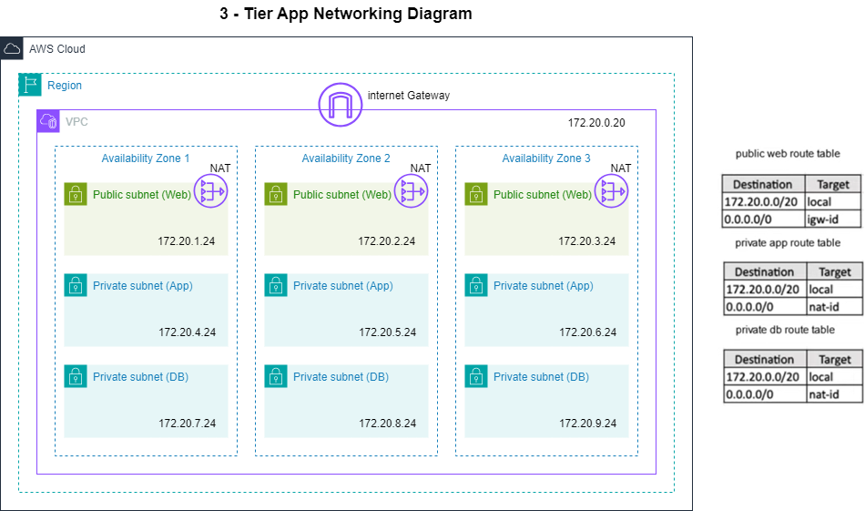

## Introduction

Build a High available and 3-Tier Network architecture on AWS using Terraform      
   

## Getting to know the Steps

| #   | Description | File |
| -------- | ------- |------- |
| 01  | Create a Provider for AWS. | `provider.tf` |
| 02  | Create a VPC (Virtual Private Cloud in AWS).| `VPC.tf` |
| 03  | Create Public Subnets with auto public IP Assignment enabled. | `*_public_subnets.tf` |
| 04  | Create Private Subnets | `*_private_subnets.tf` |
| 05  | Create an Internet Gateway for Instances in the public subnet to access the Internet.    | `IGW.tf` |
| 06  | Create a Public Route Table (Pub RT) Consisting of Internet Gateway.    | `*_public_route_table.tf` |
| 07  | Associate the Pub RT to the Public Subnets to provide the Internet Gateway address.    | `*_public_route_table_association.tf` |
| 08  | Create Elastic IPs for the NAT Gateways.    | `EIPs.tf` |
| 09  | Createa NAT Gateway for private instances to access the Internet | `NGWs.tf` |
| 10  | Create Private Route Tables (Pub RT) consisting of Nat Gateway  | `private_route_table.tf` |
| 11  | Associate the Priv RT to the Private Subnets.    | `*_private_route_table_association.tf` |

!Note: The numbers of Availabilities Zones is determined by the number public subnets set in the variable `public_web_subnets_cidr` 

## App Configuration Steps

| #   | Description | File |
| -------- | ------- |------- |
| 01  | Create an AWS key pair. | `keypair.tf` |
