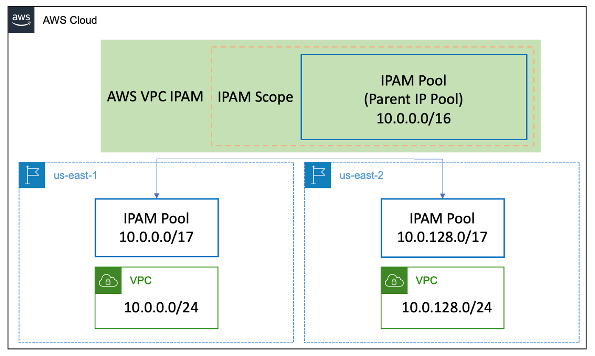

## Terraform Providers

Terraform supports many providers for deploying and managing resources. The two providers that we will be focusing on are the AWS 
and AWS Cloud Control (AWSCC) providers.

The AWS provider leverages the AWS SDK for Go and the AWS SDK for Go V2 to perform CRUD-L operations on AWS resources by accessing service-specific APIs.

The AWSCC provider uses the AWS Cloud Control API 
to perform CRUD-L operations on AWS resources by accessing the Cloud Control APIs.      
   

## Implement IPAM
This module is for implementing AWS IP Address Manager (IPAM) 
that makes it easier to plan, track, and monitor IP addresses for AWS workload.

| #   | Description | File |
| -------- | ------- |------- |
| 01  | Create Providers. | `provider.tf` |
| 02  | Deploy IPAM. | `IPAM.tf` |
| 03  | Deploy IPAM Root Pool. | `IPAM_root_pool.tf` |
| 04  | Deploy IPAM Child Pools | `IPAM_child_pools.tf` |
| 05  | Deploy a VPC in the us-east-1 region. | `VPC1.tf` |
| 06  | Deploy a VPC in the us-east-2 region. | `VPC2.tf` |
