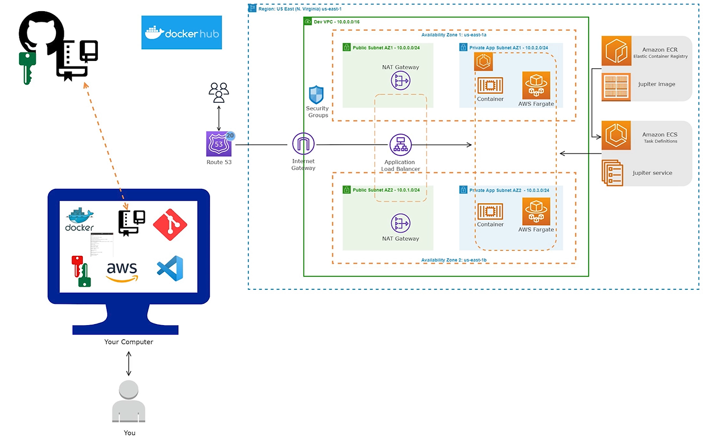

# Deploy a Static Web App on AWS with Docker, Amazon ECR, and Amazon ECS


## Final Result
  <br />

## Architecture
  <br />

## Container Setup

1) Create [Dockerfile](./jupiter-website/Dockerfile)
2) Switch to the [Docker folder](./website/) and Build the Container image: 
```sh
docker build -t jupiter . # don't forget the period at the end
```
3) For testing start a container. 
```sh
docker run -dp 80:80 jupiter
```
open it on a navigator: url -> [http://localhost:80](http://localhost:80)

Type the command docker ps to check the CONTAINER ID
```sh
docker ps

# Output
CONTAINER ID   IMAGE     COMMAND                  CREATED         STATUS         PORTS                NAMES
ab8b4910206a   jupiter   "/usr/sbin/httpd -D …"   2 minutes ago   Up 2 minutes   0.0.0.0:80->80/tcp   pedantic_hermann
```

Please don't forget to stop the container
```sh
docker stop <CONTAINER ID>
```

4) Create a repo in Docker hub and give the name "jupiter"

5) Push the container image to Docker Hub
```sh
# Tag the image with your username as prefix
docker tag jupiter <docker-username>/jupiter

# Login to your account and give the requested password
docker login -u <docker-username>

# Push the container
docker push <docker-username>/jupiter
```

7) Create [ECR Repository](./ecr.tf) and give the name "jupiter"

5) Push the container image to the ECR
```sh
# Tag the image with the ecr-repo-uri as prefix 
# "ecr-repo-uri" looks like "<registry_id>.dkr.ecr.<region>.amazonaws.com"
docker tag jupiter <ecr-repo-uri>/jupiter

# login to your account and give the requested password
aws ecr get-login-password | docker login --username AWS --password-stdin <registry_id>.dkr.ecr.<region>.amazonaws.com

docker push <ecr-repo-uri>/jupiter
```
