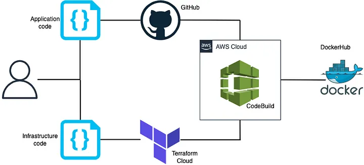

## Introduction

This goal of this module is to simplify the use of Codeuild      

## How To Use
The example use case is showed in the image below    
   

N.B. It's really important to has been connected the AWS codebuild to the github repo before. One option is Creating a "Personal Access Token" (PAT) on Github to give the access of our repository to AWS-Codebuild. The necessary accesses we need to give are "repo" and "admin:repo_hook".