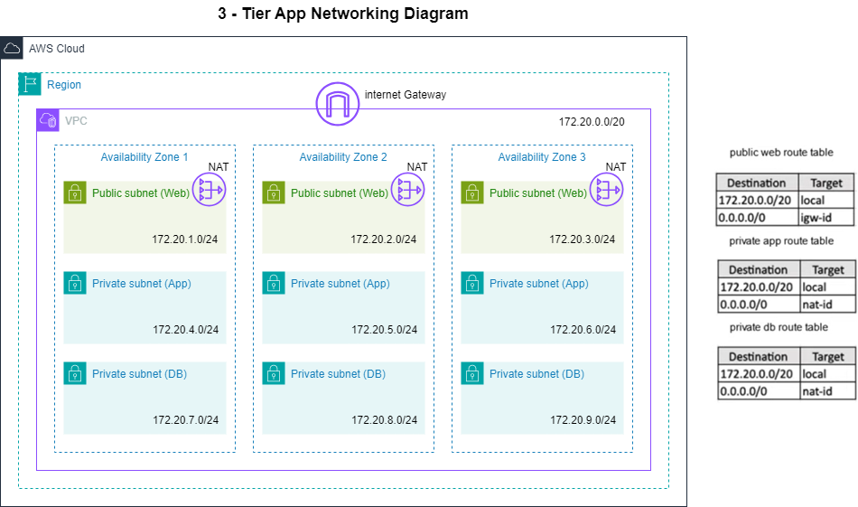

## Introduction

This is a small project to create a module that can be re-used to build a High available multi-Tier Network architecture on AWS using Terraform  <br />  <br />
  <br />

## Getting to know the Steps

| #   | Description | File |
| -------- | ------- |------- |
| 01  | Create a Provider for AWS. | `provider.tf` |
| 02  | Create a VPC (Virtual Private Cloud in AWS).| `VPC.tf` |
| 03  | Create Public Subnets with auto public IP Assignment enabled. | `public_subnets.tf` |
| 04  | Create Private Subnets | `private_subnets.tf` |
| 05  | Create an Internet Gateway for Instances in the public subnet to access the Internet.    | `IGW.tf` |
| 06  | Create a Public Route Table (Pub RT) Consisting of Internet Gateway.    | `public_route_table.tf` |
| 07  | Associate the Pub RT to the Public Subnets to provide the Internet Gateway address.    | `public_route_table_association.tf` |
| 08  | Create Elastic IPs for the NAT Gateways.    | `EIPs.tf` |
| 09  | Create a NAT Gateway for private instances to access the Internet | `NGWs.tf` |
| 10  | Create Private Route Tables (Pub RT) consisting of Nat Gateway  | `private_route_table.tf` |
| 11  | Associate the Priv RT to the Private Subnets.    | `private_route_table_association.tf` |

## How To Use

```c++

variable "region" {
  description = "Region we need to deploy the infrastructure"
  type        = string
  default     = "us-east-1"
}

module "network" {
  source = "path/to/network"

  vpc_cidr             = "172.20.0.0/20"
  enable_dns_support   = true
  enable_dns_hostnames = true

  azs_names       = slice(data.aws_availability_zones.azs.names, 0, 3)

  public_subnets  = [
          { name = "web",
            cidrs = ["172.20.1.0/24", "172.20.2.0/24", "172.20.3.0/24"] }
        ]

  private_subnets = [
          { name = "app",
            cidrs = ["172.20.4.0/24", "172.20.5.0/24", "172.20.6.0/24"] },
          { name = "db",
            cidrs = ["172.20.7.0/24", "172.20.8.0/24", "172.20.9.0/24"] }
        ]

  vpc_tags = {
    Name = "App-VPC"
  }
}
```
