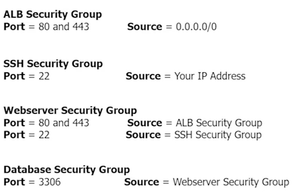

## Introduction

This goal of this module is to simplify the use of security groups  <br />  <br />

## How To Use
The example use case is showed in the image below <br /> <br />
  <br />

```c++
data "aws_vpc" "default" {
  default = true
}

locals {
  vpc_id = data.aws_vpc.default.id
}

# Security Group for the Application Load Balancer
module "alb_security_group" {
  source = "path/to/modules/security-group"

  name        = "alb-sg"
  description = "Security Group for the Application Load Balancer"
  vpc_id      = local.vpc_id
  ports = [
    { id = 80, source = ["0.0.0.0/0"] },
    { id = 443, source = ["0.0.0.0/0"] }
  ]
}

# Security Group for the Bastion Host
module "bh_security_group" {
  source = "path/to/modules/security-group"

  name        = "bh-sg"
  description = "Security Group for the Bastion Host"
  vpc_id      = local.vpc_id
  ports       = [{ id = 22, source = ["0.0.0.0/0"] }]
}

# Security Group for the Web Server
module "web_security_group" {
  source = "path/to/modules/security-group"

  name        = "Webserver-sg"
  description = "Security Group for the Web Server"
  vpc_id      = local.vpc_id
  ports = [
    { id = 80, source = [module.alb_security_group.id] },
    { id = 443, source = [module.alb_security_group.id] },
    { id = 22, source = [module.bh_security_group.id] }
  ]
}

# Security Group for the Database Server
module "db_security_group" {
  source = "path/to/modules/security-group"

  name        = "db-sg"
  description = "Security Group for the Database Server"
  vpc_id      = local.vpc_id
  ports       = [{ id = 3306, source = module.web_security_group.id }]
}
```
