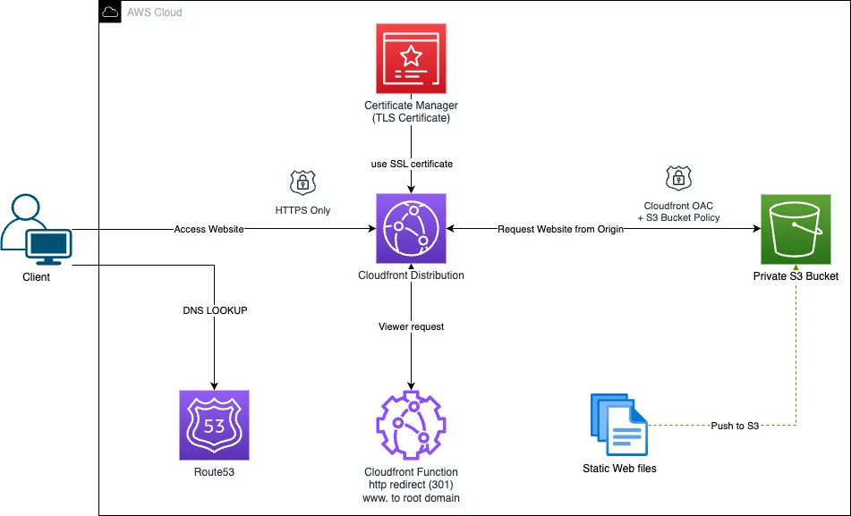

## Introduction

I am embarking on a personal project and planning to develop a static website for it. S3 appears to be an excellent choice for hosting such websites due to its high availability and cost-effectiveness. However, one downside of using S3 as a hosting platform is that the generated URLs for S3 bucket websites may not look very professional to visitors and only support insecure HTTP connections.

To overcome this limitation, I've taken the initiative to purchase a domain name from Route 53 to associate it with my S3-hosted static website. Furthermore, I've decided to employ AWS CloudFront to enable secure HTTPS connections to the S3 website endpoint.

The goal of this project is to:

- Create an S3 bucket to store the static website content.
- Configure the S3 bucket as a static website.
- Establish a CloudFront distribution to serve the website content.
- Link the CloudFront distribution with my purchased domain name in Route 53.

Upon completion of these steps, users who visit `my-domain.com` in their browser will have the index.html page, hosted in the S3 bucket, served to them from CloudFront's distribution network within their browser window.

## Architecture
   