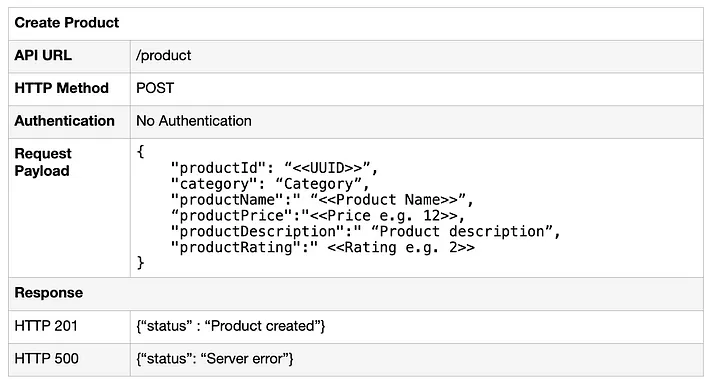
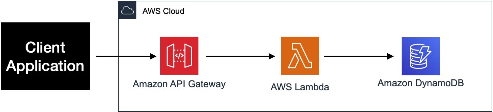

## Introduction
we'll explore the process of creating a RESTful service utilizing an API gateway and Lambda functions. DynamoDB will serve as our backend datastore, and we'll utilize Terraform to deploy all necessary AWS resources. The APIs we'll be developing include:

   

## Architecture
   
The API gateway serves as the HTTP endpoint accessed by client applications to invoke our APIs. It triggers a Lambda function responsible for executing the necessary CRUD operations on the DynamoDB table. While the API gateway provides various configuration options allowing us to adjust scaling, caching strategies, authentication mechanisms, and more, for the purposes of this article, we'll configure it as simple as possible using default parameters.